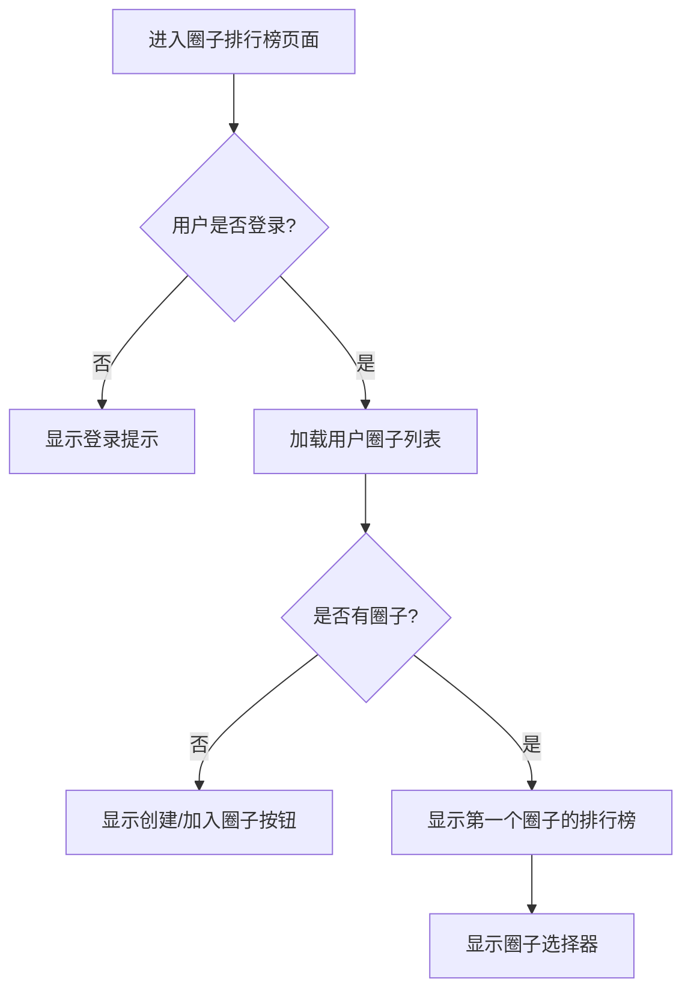
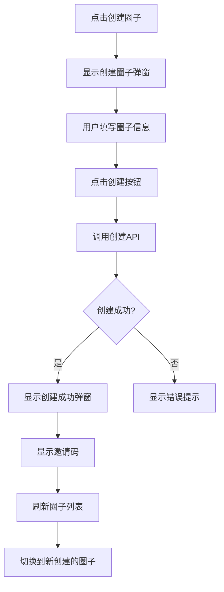
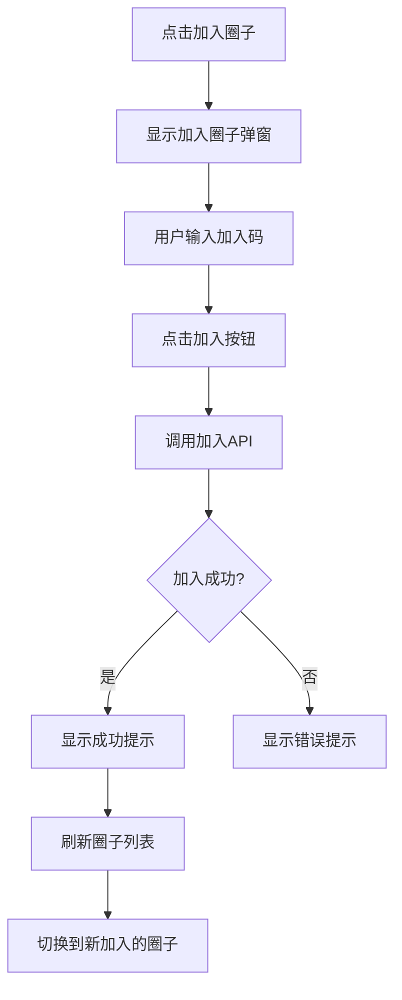
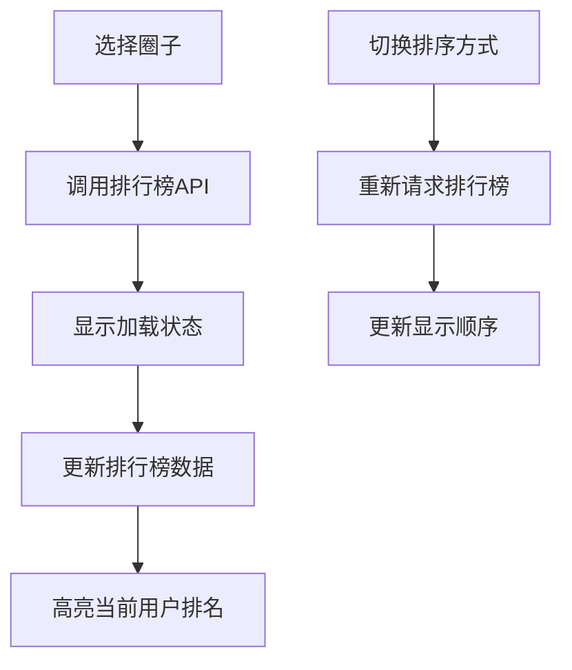

# 圈子排行榜前端UI设计

## 设计概述

本文档详细描述了圈子排行榜功能的前端UI设计和交互流程，包括页面结构、组件设计、交互逻辑等。

## 1. 页面结构设计

### 1.1 我的页面Tab结构修改

在现有的"我的"页面中，在"汇总"和"历史记录"tab之间增加"圈子排行榜"tab：

```
[汇总] [圈子排行榜] [历史记录]
```

### 1.2 圈子排行榜页面结构

```
┌─────────────────────────────────────┐
│              圈子排行榜               │
├─────────────────────────────────────┤
│  ┌─────────────────────────────────┐ │
│  │        圈子选择器区域            │ │
│  │  [我的圈子 ▼] [排序 ▼] [刷新]   │ │
│  └─────────────────────────────────┘ │
├─────────────────────────────────────┤
│  ┌─────────────────────────────────┐ │
│  │          排行榜列表             │ │
│  │  1. 张三    1500.00  [创建者]   │ │
│  │  2. 李四    1200.00  [成员]     │ │
│  │  3. 王五     800.00  [成员]     │ │
│  │  ...                           │ │
│  │  你的排名: 第5名 (800.00)       │ │
│  └─────────────────────────────────┘ │
├─────────────────────────────────────┤
│  ┌─────────────────────────────────┐ │
│  │        操作按钮区域             │ │
│  │    [创建圈子] [加入圈子]        │ │
│  └─────────────────────────────────┘ │
└─────────────────────────────────────┘
```

## 2. 组件设计

### 2.1 圈子选择器组件 (CircleSelector)

**功能：** 显示用户所在的圈子列表，支持切换

**Props：**
```javascript
{
  circles: Array,        // 圈子列表
  currentCircle: Object, // 当前选中的圈子
  loading: Boolean       // 加载状态
}
```

**Events：**
```javascript
{
  'circle-change': Function, // 圈子切换事件
  'refresh': Function        // 刷新事件
}
```

**UI结构：**
```vue
<template>
  <view class="circle-selector">
    <view class="selector-row">
      <!-- 圈子下拉选择 -->
      <view class="circle-dropdown" @click="showCircleList">
        <text class="circle-name">{{ currentCircle.name || '选择圈子' }}</text>
        <text class="dropdown-icon">▼</text>
      </view>
      
      <!-- 排序选择 -->
      <view class="sort-dropdown" @click="showSortOptions">
        <text class="sort-text">{{ sortText }}</text>
        <text class="dropdown-icon">▼</text>
      </view>
      
      <!-- 刷新按钮 -->
      <view class="refresh-btn" @click="handleRefresh">
        <text class="refresh-icon">🔄</text>
      </view>
    </view>
  </view>
</template>
```

### 2.2 排行榜列表组件 (LeaderboardList)

**功能：** 显示圈子内成员的排行榜

**Props：**
```javascript
{
  leaderboard: Array,    // 排行榜数据
  currentUserRank: Object, // 当前用户排名信息
  loading: Boolean,      // 加载状态
  sortOrder: String      // 排序方式 'desc' | 'asc'
}
```

**UI结构：**
```vue
<template>
  <view class="leaderboard-list">
    <!-- 排行榜项目 -->
    <view 
      class="leaderboard-item" 
      :class="{ 'current-user': item.user_id === currentUserId }"
      v-for="item in leaderboard" 
      :key="item.user_id"
    >
      <view class="rank-section">
        <text class="rank-number">{{ item.rank }}</text>
        <view class="rank-medal" v-if="item.rank <= 3">
          <text class="medal-icon">{{ getMedalIcon(item.rank) }}</text>
        </view>
      </view>
      
      <view class="user-section">
        <image class="user-avatar" :src="item.avatar_url" mode="aspectFill"></image>
        <view class="user-info">
          <text class="user-name">{{ item.nickname }}</text>
          <text class="user-stats">{{ item.total_rounds }}局 | 胜率{{ item.win_rate }}%</text>
        </view>
      </view>
      
      <view class="amount-section">
        <text class="amount-value" :class="getAmountClass(item.total_amount)">
          {{ formatAmount(item.total_amount) }}
        </text>
        <text class="user-role">{{ getRoleText(item.member_role) }}</text>
      </view>
    </view>
    
    <!-- 当前用户排名提示 -->
    <view class="current-user-rank" v-if="currentUserRank && !isCurrentUserVisible">
      <text class="rank-text">你的排名：第{{ currentUserRank.rank }}名</text>
      <text class="amount-text">{{ formatAmount(currentUserRank.total_amount) }}</text>
    </view>
  </view>
</template>
```

### 2.3 圈子操作组件 (CircleActions)

**功能：** 创建圈子和加入圈子的操作按钮

**Props：**
```javascript
{
  hasCircles: Boolean,   // 是否有圈子
  loading: Boolean       // 加载状态
}
```

**Events：**
```javascript
{
  'create-circle': Function, // 创建圈子事件
  'join-circle': Function    // 加入圈子事件
}
```

**UI结构：**
```vue
<template>
  <view class="circle-actions">
    <view class="action-buttons" v-if="!hasCircles">
      <text class="empty-tip">你还没有加入任何圈子</text>
      <view class="button-row">
        <button class="btn-primary" @click="handleCreateCircle">创建圈子</button>
        <button class="btn-secondary" @click="handleJoinCircle">加入圈子</button>
      </view>
    </view>
    
    <view class="quick-actions" v-else>
      <button class="btn-outline" @click="handleCreateCircle">创建新圈子</button>
      <button class="btn-outline" @click="handleJoinCircle">加入圈子</button>
    </view>
  </view>
</template>
```

## 3. 弹窗组件设计

### 3.1 创建圈子弹窗 (CreateCircleModal)

**UI结构：**
```vue
<template>
  <uni-popup ref="createModal" type="center">
    <view class="modal-content">
      <view class="modal-header">
        <text class="modal-title">创建圈子</text>
        <text class="close-btn" @click="closeModal">×</text>
      </view>
      
      <view class="modal-body">
        <view class="form-item">
          <text class="form-label">圈子名称</text>
          <input 
            class="form-input" 
            v-model="formData.name" 
            placeholder="请输入圈子名称"
            maxlength="100"
          />
        </view>
        
        <view class="form-item">
          <text class="form-label">圈子描述（可选）</text>
          <textarea 
            class="form-textarea" 
            v-model="formData.description" 
            placeholder="请输入圈子描述"
            maxlength="500"
          />
        </view>
      </view>
      
      <view class="modal-footer">
        <button class="btn-cancel" @click="closeModal">取消</button>
        <button class="btn-confirm" @click="handleConfirm" :disabled="!formData.name">创建</button>
      </view>
    </view>
  </uni-popup>
</template>
```

### 3.2 加入圈子弹窗 (JoinCircleModal)

**UI结构：**
```vue
<template>
  <uni-popup ref="joinModal" type="center">
    <view class="modal-content">
      <view class="modal-header">
        <text class="modal-title">加入圈子</text>
        <text class="close-btn" @click="closeModal">×</text>
      </view>
      
      <view class="modal-body">
        <view class="form-item">
          <text class="form-label">加入码</text>
          <input 
            class="form-input join-code-input" 
            v-model="joinCode" 
            placeholder="请输入5位加入码"
            maxlength="5"
            @input="formatJoinCode"
          />
          <text class="input-tip">请输入圈子创建者提供的5位加入码</text>
        </view>
      </view>
      
      <view class="modal-footer">
        <button class="btn-cancel" @click="closeModal">取消</button>
        <button class="btn-confirm" @click="handleJoin" :disabled="joinCode.length !== 5">加入</button>
      </view>
    </view>
  </uni-popup>
</template>
```

### 3.3 创建成功弹窗 (CreateSuccessModal)

**UI结构：**
```vue
<template>
  <uni-popup ref="successModal" type="center">
    <view class="modal-content success-modal">
      <view class="success-icon">✓</view>
      <text class="success-title">圈子创建成功！</text>
      
      <view class="join-code-section">
        <text class="join-code-label">邀请码</text>
        <view class="join-code-display">
          <text class="join-code-text">{{ joinCode }}</text>
          <button class="copy-btn" @click="copyJoinCode">复制</button>
        </view>
        <text class="join-code-tip">分享此邀请码给朋友，让他们加入你的圈子</text>
      </view>
      
      <view class="modal-footer">
        <button class="btn-primary" @click="closeModal">知道了</button>
      </view>
    </view>
  </uni-popup>
</template>
```

## 4. 页面交互流程

### 4.1 初始化流程



### 4.2 创建圈子流程



### 4.3 加入圈子流程



### 4.4 排行榜切换流程



## 5. 样式设计规范

### 5.1 颜色规范

```scss
// 主色调
$primary-color: #5D688A;
$secondary-color: #8B9BB5;

// 状态颜色
$success-color: #52c41a;
$error-color: #ff4d4f;
$warning-color: #faad14;

// 排行榜颜色
$gold-color: #FFD700;    // 第一名
$silver-color: #C0C0C0;  // 第二名
$bronze-color: #CD7F32;  // 第三名

// 金额颜色
$positive-amount: #ff4d4f; // 正数（赢）- 红色
$negative-amount: #52c41a; // 负数（输）- 绿色
```

### 5.2 组件样式

```scss
// 圈子选择器
.circle-selector {
  background: #fff;
  padding: 32rpx;
  border-radius: 16rpx;
  margin: 24rpx;
  box-shadow: 0 4rpx 12rpx rgba(0, 0, 0, 0.1);
  
  .selector-row {
    display: flex;
    align-items: center;
    justify-content: space-between;
  }
  
  .circle-dropdown, .sort-dropdown {
    display: flex;
    align-items: center;
    padding: 16rpx 24rpx;
    background: #f5f5f5;
    border-radius: 8rpx;
    min-width: 200rpx;
  }
}

// 排行榜列表
.leaderboard-list {
  margin: 24rpx;
  
  .leaderboard-item {
    display: flex;
    align-items: center;
    padding: 24rpx;
    background: #fff;
    border-radius: 16rpx;
    margin-bottom: 16rpx;
    box-shadow: 0 2rpx 8rpx rgba(0, 0, 0, 0.1);
    
    &.current-user {
      border: 2rpx solid $primary-color;
      background: rgba(93, 104, 138, 0.05);
    }
  }
  
  .rank-section {
    width: 80rpx;
    display: flex;
    align-items: center;
    justify-content: center;
    
    .rank-number {
      font-size: 32rpx;
      font-weight: bold;
      color: $primary-color;
    }
    
    .medal-icon {
      font-size: 40rpx;
    }
  }
  
  .user-section {
    flex: 1;
    display: flex;
    align-items: center;
    margin-left: 24rpx;
    
    .user-avatar {
      width: 80rpx;
      height: 80rpx;
      border-radius: 50%;
      margin-right: 24rpx;
    }
    
    .user-info {
      .user-name {
        font-size: 32rpx;
        font-weight: 500;
        color: #333;
        display: block;
        margin-bottom: 8rpx;
      }
      
      .user-stats {
        font-size: 24rpx;
        color: #666;
      }
    }
  }
  
  .amount-section {
    text-align: right;
    
    .amount-value {
      font-size: 36rpx;
      font-weight: bold;
      display: block;
      margin-bottom: 8rpx;
      
      &.positive {
        color: $positive-amount;
      }
      
      &.negative {
        color: $negative-amount;
      }
    }
    
    .user-role {
      font-size: 24rpx;
      color: #999;
      padding: 4rpx 12rpx;
      background: #f0f0f0;
      border-radius: 12rpx;
    }
  }
}

// 弹窗样式
.modal-content {
  width: 600rpx;
  background: #fff;
  border-radius: 24rpx;
  overflow: hidden;
  
  .modal-header {
    display: flex;
    align-items: center;
    justify-content: space-between;
    padding: 32rpx;
    border-bottom: 1rpx solid #f0f0f0;
    
    .modal-title {
      font-size: 36rpx;
      font-weight: 600;
      color: #333;
    }
    
    .close-btn {
      font-size: 48rpx;
      color: #999;
      width: 48rpx;
      height: 48rpx;
      display: flex;
      align-items: center;
      justify-content: center;
    }
  }
  
  .modal-body {
    padding: 32rpx;
    
    .form-item {
      margin-bottom: 32rpx;
      
      .form-label {
        font-size: 28rpx;
        color: #333;
        margin-bottom: 16rpx;
        display: block;
      }
      
      .form-input, .form-textarea {
        width: 100%;
        padding: 24rpx;
        border: 2rpx solid #e0e0e0;
        border-radius: 12rpx;
        font-size: 28rpx;
        
        &:focus {
          border-color: $primary-color;
        }
      }
      
      .input-tip {
        font-size: 24rpx;
        color: #999;
        margin-top: 8rpx;
        display: block;
      }
    }
  }
  
  .modal-footer {
    display: flex;
    padding: 32rpx;
    gap: 24rpx;
    border-top: 1rpx solid #f0f0f0;
    
    .btn-cancel, .btn-confirm {
      flex: 1;
      height: 80rpx;
      border-radius: 12rpx;
      font-size: 28rpx;
    }
    
    .btn-cancel {
      background: #f5f5f5;
      color: #666;
    }
    
    .btn-confirm {
      background: $primary-color;
      color: #fff;
      
      &:disabled {
        background: #ccc;
      }
    }
  }
}
```

## 6. 响应式设计

### 6.1 适配不同屏幕尺寸

- 使用rpx单位确保在不同设备上的一致性
- 排行榜列表项在小屏幕上自动调整布局
- 弹窗在小屏幕上占据更多空间

### 6.2 加载状态设计

```vue
<!-- 加载骨架屏 -->
<template>
  <view class="skeleton-list">
    <view class="skeleton-item" v-for="i in 5" :key="i">
      <view class="skeleton-rank"></view>
      <view class="skeleton-avatar"></view>
      <view class="skeleton-info">
        <view class="skeleton-name"></view>
        <view class="skeleton-stats"></view>
      </view>
      <view class="skeleton-amount"></view>
    </view>
  </view>
</template>
```

## 7. 错误处理设计

### 7.1 网络错误

- 显示重试按钮
- 提供离线提示
- 缓存上次成功的数据

### 7.2 数据为空

- 显示友好的空状态插图
- 提供相关操作建议
- 引导用户创建或加入圈子

### 7.3 权限错误

- 显示权限不足提示
- 引导用户登录或联系管理员

## 8. 性能优化

### 8.1 数据缓存

- 缓存圈子列表数据
- 缓存排行榜数据（5分钟有效期）
- 使用本地存储减少网络请求

### 8.2 懒加载

- 排行榜列表支持分页加载
- 图片懒加载
- 组件按需加载

### 8.3 交互优化

- 防抖处理搜索和筛选
- 乐观更新提升用户体验
- 预加载下一页数据

## 9. 无障碍设计

- 为所有交互元素添加适当的aria标签
- 确保颜色对比度符合WCAG标准
- 支持键盘导航
- 为屏幕阅读器提供语义化标签

## 10. 实现优先级

### 高优先级
1. 基础页面结构和Tab集成
2. 圈子选择器组件
3. 排行榜列表组件
4. 创建/加入圈子弹窗

### 中优先级
1. 排序功能
2. 刷新功能
3. 用户排名高亮
4. 加载状态和错误处理

### 低优先级
1. 动画效果
2. 骨架屏
3. 高级筛选功能
4. 数据导出功能